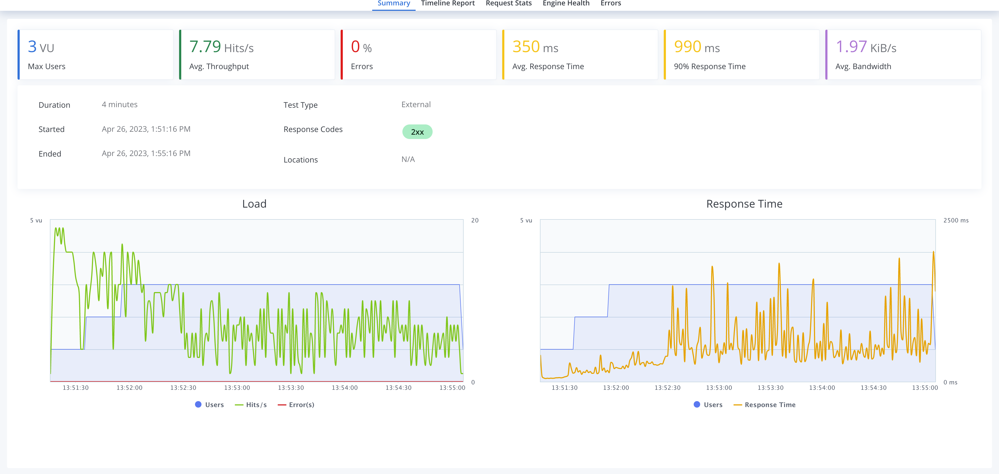
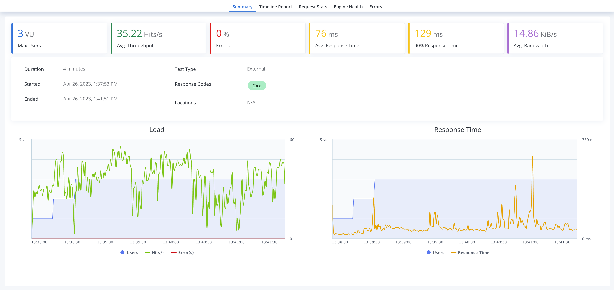

# 🔖 Nameko-devex Back-end Test

## ⚙️ How to run

* Informations about how to run the project locally, as well as unit, smoke and performance tests and performance tests are inside the `README-DevEnv.md`

## ✏️ Implemented Tasks

#### The files that were changed are on the `orders`, `products` and `gateway/gateway` folders, new routes, tests and extra functionalities were added to the application

* [x] Enhance product service
    * Add a `Patch` method
    * Implement a products listing method
        * Add LRU cache to the `get` method
        * Add pagination and page size products listing
        * Add filtering options to the list method, filtering data by their respective titles
* [x] Delete product rpc call
* [x] (Extra) List orders rpc call
* [x] Wire into [smoketest.sh](http://smoketest.sh/)
* [x] (bonus) Wire into perf-test
* [x] (bonus) Wire unit-test for this method

- - -

* [x] Enhance order service
    * Classes were organized in a different manner, adding an `OrderServiceMixin` and `OrderDetailServiceMixin` to the `OrdersService`
    * Implemented a caching system using `lru_cache` for the
    * Adjusted the `_create_order` method, calling the `get` method instead of listing products
    * The same was done for the `_get_order` method, calling only the `get` method, boosting the application's performance
* [x] List orders rpc call
    * Pagination and per page query methods were implemented
* [x] (Extra) Delete orders rpc call
* [x] Wire into [smoketest.sh](http://smoketest.sh/)
* [x] (bonus) Wire into perf-test
* [x] (bonus) Wire unit-test for this method

- - -

### 🧪 Performance test questions

**Question 1**: Why is performance degrading as the test run longer?

* The initial project had a degrading performance when running the perfomance tests using blazemeter, these tests are ran with the following command: `(nameko-devex) ./test/nex-bzt.sh local`

* As it can be seen in the image above, the performance of the application degrades as the test runs longer, this happens because as products and orders are created, the database size increases, and in the original application the `create` and `get` methods of the `orders` fetches all products in order to check if the product exists, this causes the application to slow down as the database size increases, because more items are being fetched from the database in an O(n) operation (where n is the number of products in the database)

**Question 2**: How do you fix it?

* This problem can be fixed by adding a constant O(1) `get` request to the products to check for its existance and fullfill image related content, as it was stated on the `Enhance product service` task description. This in turn decreased a lot of the application's response time, as it can be seen in the image below:

* The performance of the application is more controlled after the update, before it kept constantly increasing as the database size increased. The usage of caching also helps with the performance of the application, as it was done for both services. As well as pagination, which helps with the performance of the application as it doesn't need to fetch all the data at once, but instead fetches it in chunks.

### 🔨 Further enhancements
* Note that the answers provided are on the context of the application's unnecessary complexity on fetch requests, as well as simple caching functionalities, but more changes can be made to make the app behave better and to make it more performatic, those changes are:
    * Database Indexing, ensuring that database columns that are frequently used in queries, like the product ID for example
    * Optimization of database queries, as it is seen on the nested `order_details` properties, making sure that the `JOIN` method only fetches the required data and with the correct `WHERE` clauses
    * Implement a Load Balancing mechanism distributing incoming requests across multiple instances of the application, possibly running on different machines, being able to handle more simultaneous users and maintain a consistent performance
* These methods are used by the `orders` and `products` services:

    

 